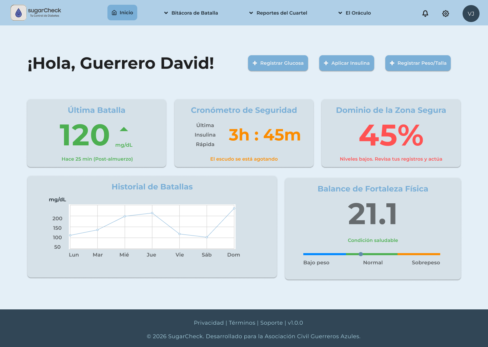

# 🛡️ SugarCheck

**SugarCheck** es una aplicación móvil diseñada para transformar el manejo de la diabetes infantil en una aventura épica. A través de la gamificación y una interfaz amigable, ayudamos a los niños a llevar un registro de su salud mientras se sienten como verdaderos héroes, y brindamos a los padres las herramientas necesarias para monitorear y configurar el tratamiento.

## 🎯 El Propósito
El control de la glucosa y la administración de insulina puede ser un proceso estresante para los niños. *SugarCheck* cambia la narrativa: las inyecciones son "pociones", la comida saludable son "manzanas doradas" y mantener la glucosa estable es mantenerse en la "Zona Sagrada". 

## ✨ Características Principales (Features)

* 🏰 **Cuartel General (Home):** Registro rápido de niveles de energía (glucosa), alquimia de alimentos y pociones (insulina) usando iconos intuitivos para niños.
* 📜 **Crónicas de Batalla (Historial):** Gráficos visuales amigables con franjas de "Zona Segura" para ver los altibajos de energía. Incluye un historial detallado exportable para médicos.
* 🧙‍♂️ **El Gran Oráculo (Asistente Inteligente):** Un chat interactivo donde el niño puede hacer preguntas rápidas sobre su energía, qué comer o recibir mensajes de motivación del "Oráculo Azul".
* 👤 **Perfil del Guerrero (Gamificación):** Sistema de niveles, rachas de victorias y personalización de avatares y armaduras.
* ⚙️ **Configuración de la Orden (Control Parental):** Área protegida para que los padres configuren "Guardianes" (contactos de emergencia), ajusten dosis médicas, vinculen sensores y programen "Recordatorios de Batalla" (alarmas).

## 🎨 Diseño y UI/UX
Toda la interfaz fue diseñada pensando en la accesibilidad y la psicología infantil:
* **Paleta de colores:** Tonos azules y verdes que transmiten calma y salud, con alertas claras en colores cálidos.
* **Tipografía:** Redondeada y de alta legibilidad.
* **Iconografía propia:** Elementos de RPG (espadas, escudos, pergaminos, cristales de energía).

## 🛠️ Herramientas Utilizadas
* **Diseño de Interfaz y Prototipado:** Figma
* **Ilustraciones e Iconos:** Generación de assets personalizados y diseño vectorial.

## 👥 Equipo de Diseño
* **David** - UI/UX Designer
* **Natalia** - UI/UX Designer

---
*"La valentía no es no tener miedo, es medir tu energía y seguir adelante."* ⚔️💙
